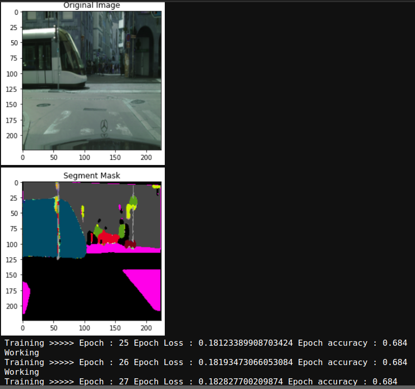
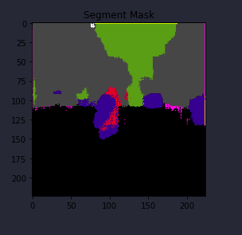
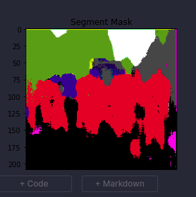
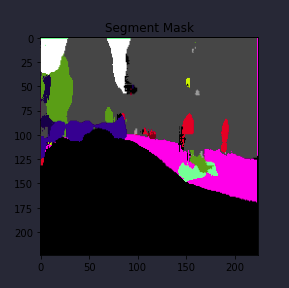
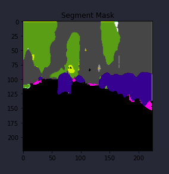
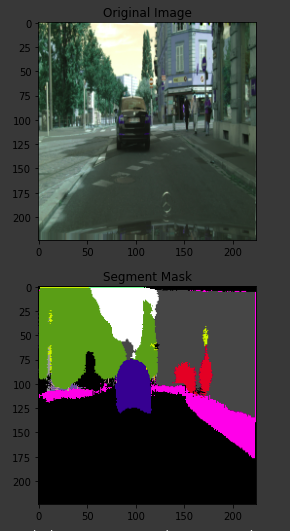
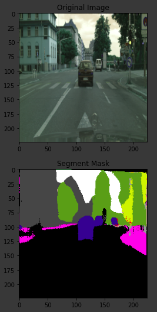
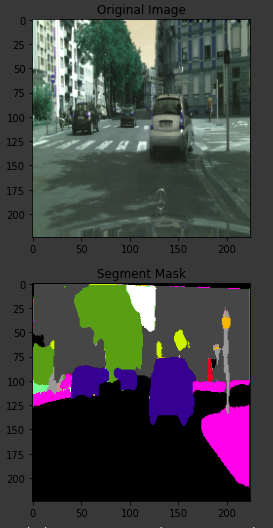

# **Cityscapes Semantic Segmentation** 


### Below is the depth review of my Semantic Segmentation Project based on  [Cityscapes](https://www.cityscapes-dataset.com/) data set .

---

**Build the Semantic Segmentation  Project**

The goals / steps of this project are the following:
* Load the data set (see below for links to the project data set)
* Explore, summarize and visualize the data set
* Design, train and test a model architecture
* Use the model to make predictions on new images

---


### Data Set Summary & Exploration

#### 1. Provide some samples from the original data set .


### Design and Test a Model Architecture


#### 2. UNet With Skip Connections   .


 


#### 3. Model Training Results


 

### Test the Model Performance

#### 1. Cityscpaes dataset is a challenging datasets because it contains more classes than simple semantic segmentation data set.To more understand about the data set follow the original data set site mention above . 










### Run the notebook your self

1. Download the data set [Cityscapes ](https://www.cityscapes-dataset.com/) . This is a image dataset . It contains a training, validation and test set with ground truth data .
2. Clone the project, which contains the Ipython notebook and the utility python scripts .
```sh
git clone https://github.com/himasha0421/Semantic-Segmentation-Cityscapes.git
cd Semantic-Segmentation-Cityscapes
jupyter notebook cityscape_tf.ipynb
```
3. follow the jupyter notebook along with the utility python scripts . Easy to run the jupyter notebook prefer GPU environment (google colab)
